# Database ERD

```mermaid
erDiagram
  users ||--o{ refresh_sessions : owns
  users ||--o{ audit_logs : writes
  users ||--o{ wealth_entries : owns
  users ||--o{ receipts : owns
  users ||--o{ assets : owns
  users ||--o{ asset_value_history : owns
  users ||--o{ vault_documents : owns
  users ||--o{ ocr_results : owns
  users ||--o{ financial_goals : owns
  users ||--o{ goal_contributions : owns
  users ||--o{ notifications : owns
  users ||--o| notification_preferences : configures
  users ||--o{ automation_jobs : owns
  users ||--o| backup_settings : configures
  users ||--o{ backup_runs : owns
  users ||--o{ timeline_events : records

  app_settings {
    string id PK
    boolean registration_enabled
    string default_currency
    numeric primary_goal_amount
    string primary_goal_currency
  }

  users {
    string id PK
    string email
    string role
    string timezone
    string preferred_currency
  }

  wealth_entries {
    string id PK
    string user_id FK
    date entry_date
    string income_source
    numeric realised_profit
    string currency
    numeric actual_savings
    string receipt_id FK
    string idempotency_key
  }

  receipts {
    string id PK
    string user_id FK
    string original_filename
    string stored_filename
    string sha256
    datetime uploaded_at
    datetime deleted_at
  }

  assets {
    string id PK
    string user_id FK
    string category
    string asset_name
    string currency
    numeric purchase_price
    numeric current_value
    numeric exchange_rate_to_primary
    string institution
    string reference
    string status
  }

  asset_value_history {
    string id PK
    string asset_id FK
    string user_id FK
    numeric previous_value
    numeric new_value
    string currency
    date valuation_date
    string source
    datetime recorded_at
  }

  vault_documents {
    string id PK
    string user_id FK
    string asset_id FK
    string folder
    string storage_area
    string original_filename
    string encrypted_filename
    string sha256
    string checksum
    string tags
    datetime uploaded_at
    datetime deleted_at
  }

  ocr_results {
    string id PK
    string user_id FK
    string source_type
    string source_id
    text extracted_text
    numeric amount
    string currency
    date document_date
    string document_time
    string reference
    string recipient
    string sender
    text extracted_fields_json
    text amount_candidates_json
    string engine_name
    integer retry_count
    numeric confidence_score
    string status
  }

  financial_goals {
    string id PK
    string user_id FK
    string name
    string description
    string category
    string currency
    numeric target_amount
    numeric starting_amount
    numeric current_amount
    date deadline
    string progress_source
    boolean is_primary
    string status
    datetime completed_at
    datetime archived_at
  }

  goal_contributions {
    string id PK
    string goal_id FK
    string user_id FK
    numeric amount
    string currency
    date contribution_date
    string source_type
    string source_id
  }

  notifications {
    string id PK
    string user_id FK
    string title
    string type
    string channel
    string status
    string deduplication_key
    datetime created_at
  }

  notification_preferences {
    string id PK
    string user_id FK
    boolean telegram_enabled
    boolean daily_reminder_enabled
    string daily_reminder_time
    boolean weekly_summary_enabled
    boolean goal_alerts_enabled
    boolean ocr_alerts_enabled
    boolean backup_alerts_enabled
  }

  automation_jobs {
    string id PK
    string user_id FK
    string job_type
    boolean enabled
    string cadence
    string run_at_time
    datetime next_run_at
  }

  backup_runs {
    string id PK
    string user_id FK
    string job_id FK
    string trigger
    string status
    string backup_filename
    string sha256
    boolean restore_verified
  }

  backup_settings {
    string id PK
    string user_id FK
    boolean enabled
    string frequency
    string run_time
    integer retention_daily
    integer retention_weekly
    integer retention_monthly
    string backup_path
  }

  timeline_events {
    string id PK
    string user_id FK
    string event_type
    string title
    datetime occurred_at
    string entity_type
    string entity_id
  }

  assets ||--o{ asset_value_history : records
  assets ||--o{ vault_documents : contains
  receipts ||--o| wealth_entries : attaches
  financial_goals ||--o{ goal_contributions : records
  automation_jobs ||--o{ backup_runs : creates
```

`ocr_results.source_id` points to either `receipts.id` or `vault_documents.id` according to `source_type`. This is intentionally not a database foreign key because the OCR foundation supports more source types later without rewriting the table.
